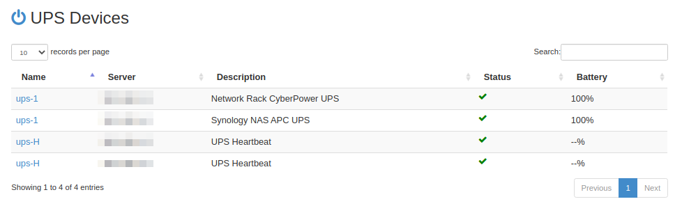
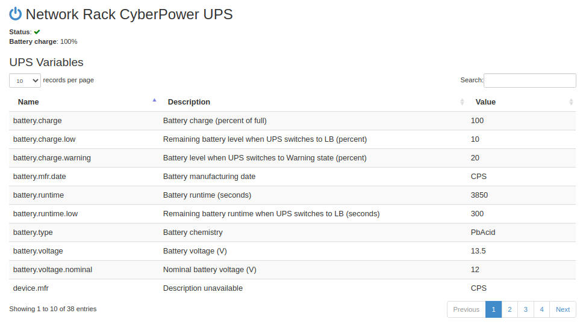

webNUT
======

A simple web interface for NUT ([Network UPS Tools][1])
servers, built on Pyramid, Bootstrap, and
[python-nut2][2].

[1]: http://www.networkupstools.org/ "Network UPS Tools"
[2]: https://github.com/george2/python-nut2 "python-nut2"

## Setup

Rename `webnut/config.example.py` to `webnut/config.py` and set the
variables in that file to reflect your NUT server configuration. Then
serve webNUT as you would any Pyramid app, using `pserve` or through
your production-ready server of choice.

## Screenshots

The index lists available UPS devices, along with their description,
status, and battery charge:

Clicking on a UPS's name takes you to a details view that shows a quick
status indicator, as well as the values of all variables set on the
device:

